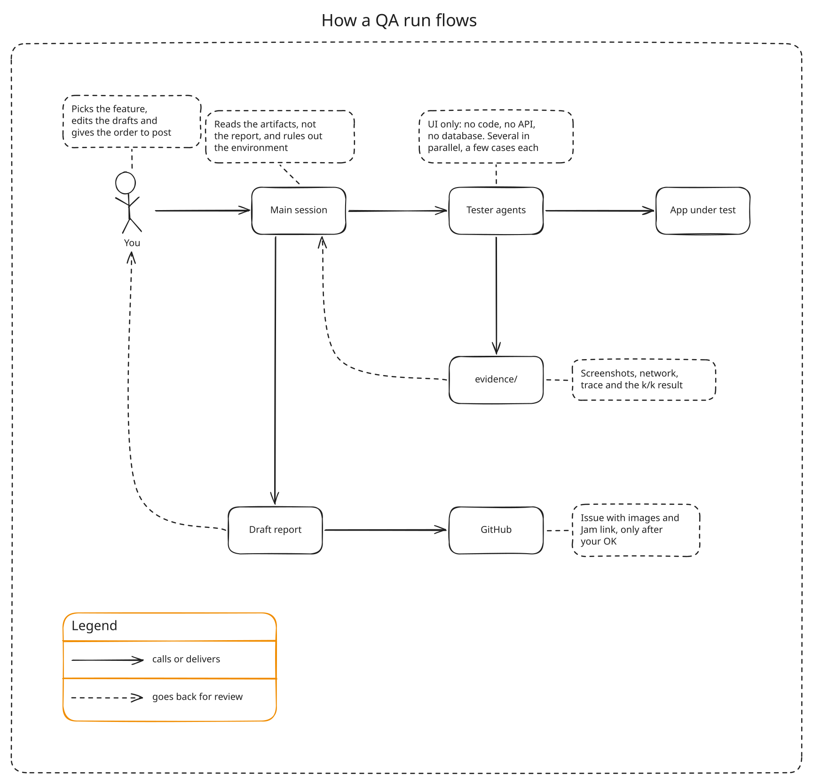

# mini-qa-harness

[Português](README.pt-BR.md)

A small harness that lets LLM agents test a web app through its UI, the way a person would, and turns what they find into bug reports a developer can reproduce: numbered screenshots, the network calls the page made, a Playwright trace and, when you want it, a Jam video. Nothing is posted until a human approves it.

<picture>
  <source media="(prefers-color-scheme: dark)" srcset="docs/diagrams/flow.en.dark.svg">
  
</picture>

It came out of a real QA push on a staging environment, where a few small agents tested tickets in parallel and a reviewing session threw out every "bug" that was really a stale deploy, a missing migration or a missing permission. This repo is that harness with the project-specific parts replaced by configuration.

## What is in the box

| Piece | What it does |
|---|---|
| `src/` (library) | sessions that record their own evidence, `reproduce()` that reruns a case in fresh browsers and reports `BUG 2/2`, auth adapters (saved login, cookie, header, minted JWT), a drawn cursor for videos, Jam recording, GitHub image upload, issue rendering |
| `bin/qa.mjs` (CLI) | `qa smoke`, `qa login`, `qa jam setup/login/smoke`, `qa gh login/upload/check`, `qa issue render` |
| `skill/mini-qa/` | a Claude Code skill: the phases, the rules, the tester prompt, the verification checklist |
| `demo/` | a tiny notes app with two planted bugs and one environment trap, for the tutorial |
| `templates/bug-report.md` | the report format |

## Try it in five minutes

```bash
git clone https://github.com/joaomrpimentel/mini-qa-harness && cd mini-qa-harness
npm install && npx playwright install chromium
node demo/server.mjs &              # demo app on http://localhost:4173
node bin/qa.mjs smoke               # signs in as admin and viewer, screenshots in evidence/smoke/
node examples/delete-pinned.mjs     # BUG 2/2
```

Then follow the [tutorial](docs/en/tutorial/01-run-the-demo.md).

## Documentation

| If you want to... | Read |
|---|---|
| learn it by finding your first bug in the demo app | [Tutorial](docs/en/tutorial/01-run-the-demo.md) |
| point it at your app, run it with Claude Code, record with Jam, post to GitHub | [How-to guides](docs/en/README.md#how-to-guides) |
| look up a config key, a function or a CLI command | [Reference](docs/en/README.md#reference) |
| understand why it is built this way | [How it works](docs/en/explanation/how-it-works.md), [Verification](docs/en/explanation/verification.md), [Related tools](docs/en/explanation/landscape.md) |

## Status

Version 0.1. The library and the CLI are tested against the demo app. The Jam part drives the Jam extension's own UI, so a Jam release can break it; [record-with-jam](docs/en/how-to/record-with-jam.md) says where to look.

## License

MIT
