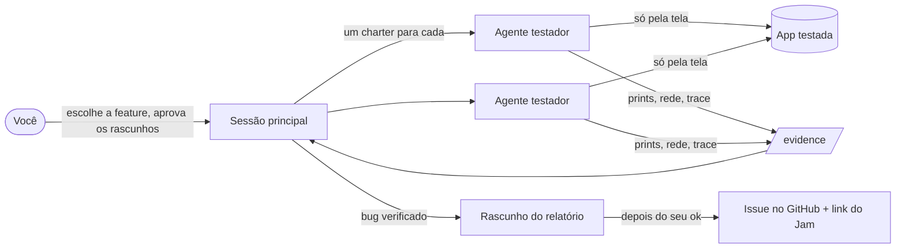

# mini-qa-harness

[English](README.md)

Um harness pequeno para agentes de LLM testarem uma aplicação web pela tela, como uma pessoa testaria, e transformarem o que acham em bug que um dev consegue reproduzir: prints numeradas, as chamadas de rede que a própria página fez, um trace do Playwright e, se você quiser, um vídeo do Jam. Nada é postado sem uma pessoa aprovar.



Ele nasceu de uma força-tarefa de QA num ambiente de staging. Alguns agentes pequenos testavam tickets em paralelo, e uma sessão revisora descartava todo "bug" que na verdade era deploy velho, migration faltando ou permissão ausente. Este repo é aquele harness, com as partes específicas do projeto trocadas por configuração.

## O que vem no pacote

| Peça | O que faz |
|---|---|
| `src/` (biblioteca) | sessão que grava a própria evidência, `reproduce()` que roda o caso de novo em browser limpo e devolve `BUG 2/2`, adaptadores de login (sessão salva, cookie, header, JWT gerado), cursor desenhado para vídeo, gravação no Jam, upload de imagem no GitHub, montagem do corpo da issue |
| `bin/qa.mjs` (CLI) | `qa smoke`, `qa login`, `qa jam setup/login/smoke`, `qa gh login/upload/check`, `qa issue render` |
| `skill/mini-qa/` | uma skill do Claude Code com as fases, as regras, o prompt do testador e o checklist de verificação |
| `demo/` | um app de notas mínimo com dois bugs plantados e uma armadilha de ambiente, para o tutorial |
| `templates/bug-report.md` | o formato do relatório |

## Testar em cinco minutos

```bash
git clone https://github.com/joaomrpimentel/mini-qa-harness && cd mini-qa-harness
npm install && npx playwright install chromium
node demo/server.mjs &              # app demo em http://localhost:4173
node bin/qa.mjs smoke               # entra como admin e como viewer, prints em evidence/smoke/
node examples/delete-pinned.mjs     # BUG 2/2
```

Depois siga o [tutorial](docs/pt-BR/tutorial/01-run-the-demo.md).

## Documentação

| Se você quer... | Leia |
|---|---|
| aprender achando seu primeiro bug no app demo | [Tutorial](docs/pt-BR/tutorial/01-run-the-demo.md) |
| apontar para a sua aplicação, rodar com o Claude Code, gravar com o Jam, postar no GitHub | [Guias práticos](docs/pt-BR/README.md#guias-práticos) |
| consultar uma chave de config, uma função ou um comando | [Referência](docs/pt-BR/README.md#referência) |
| entender por que ele é desse jeito | [Como funciona](docs/pt-BR/explanation/how-it-works.md), [Verificação](docs/pt-BR/explanation/verification.md), [Ferramentas parecidas](docs/pt-BR/explanation/landscape.md) |

## Estado

Versão 0.1. A biblioteca e a CLI foram testadas contra o app demo. A parte do Jam dirige a interface da própria extensão, então uma versão nova do Jam pode quebrá-la; [record-with-jam](docs/pt-BR/how-to/record-with-jam.md) diz onde olhar.

## Licença

MIT
