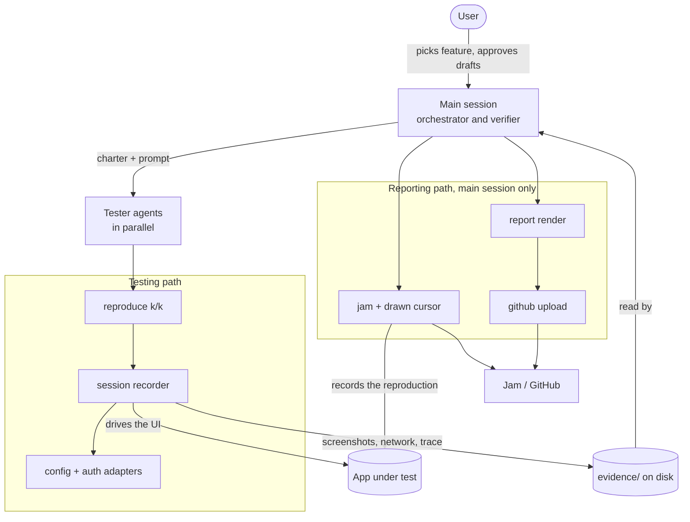
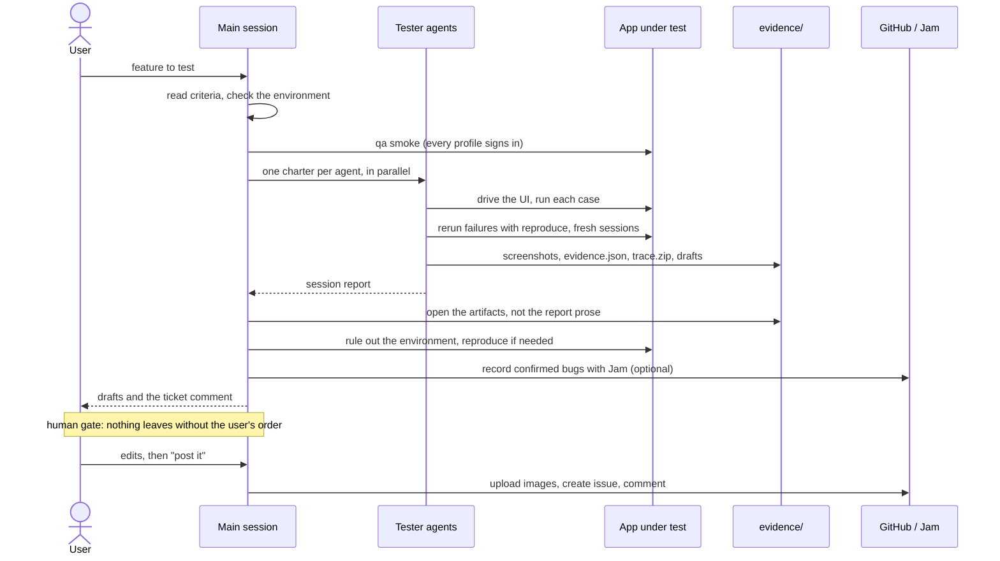
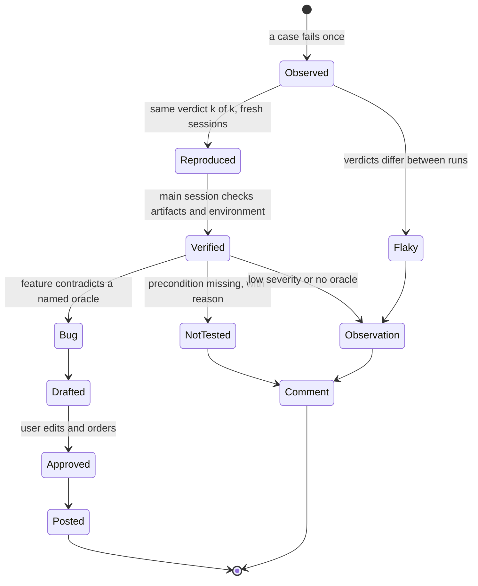
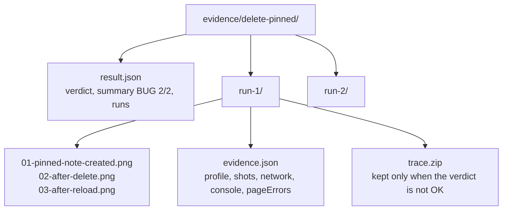

# How the harness works

This page explains the design: who does what, what each piece of the library is for, and why it is built this way. For the steps, follow the [tutorial](../tutorial/01-run-the-demo.md). For the exact functions and fields, see the [API reference](../reference/api.md) and the [evidence format](../reference/evidence.md).

## Where it came from

The harness started as a set of scripts used to QA a web application in its staging environment. Features piled up waiting for homologation and the QA team could not keep up. Each feature had to leave with one of two results: a comment saying it was tested and nothing was found, or a bug report a developer could reproduce without asking anything. The scripts let an LLM agent test the back office through the screen, the way a user would, without a false bug or an invented sentence reaching the issue tracker. This repo is those scripts with everything specific to that platform taken out: the login, the permission system and the domain became configuration.

## The pieces

How to read it: the testing path, on top, never reaches Jam or GitHub. Testers touch the library only through `reproduce` and the session, and the session is the only thing that talks to the app. Everything a tester produces lands in `evidence/`, and the main session reads it from there. The reporting path, at the bottom, belongs to the main session alone, and its arrows to the outside world are used only after the user has approved a draft.

| Piece | File | What it does |
|---|---|---|
| config + auth adapters | `src/config.mjs`, `src/auth/index.mjs` | where the app is, which profiles exist and how each one signs in |
| session recorder | `src/session.mjs` | a logged-in page that records its own network, console, screenshots and trace |
| reproduce | `src/reproduce.mjs` | runs a case k times, each in a fresh browser, and counts matching verdicts |
| drawn cursor | `src/cursor.mjs` | a visible mouse pointer and human-speed clicks for recordings |
| jam | `src/jam.mjs` | drives the Jam extension inside Playwright's Chromium |
| github upload | `src/github.mjs` | uploads images through a signed-in browser and checks they load |
| report render | `src/report.mjs` | turns a draft into an issue title and body, refusing broken images |

## One QA run

How to read it: the line that matters is the note. Before it, everything is local and can be thrown away. After it, text goes out under someone's name. The verifier step reads `evidence/`, not the session report, which is why there are two arrows from the main session into the right side: one to the artifacts and one back to the app.

## What happens to a finding

How to read it: only one path reaches `Posted` as an issue, and it crosses three filters: reproduction, verification and approval. The other exits are not failures of the process. `NotTested` and `Observation` still go out, inside the comment on the feature ticket, so the team knows what was not covered and why.

## What a session writes

How to read it: one folder per case, one subfolder per run. The screenshots are numbered in the order they were taken, so the folder reads as the steps. `evidence.json` holds what the page did on the network (bodies only for errors and writes) and what it printed to the console. The Playwright trace, with DOM snapshots and network bodies, is kept only for runs that did not pass, because it is heavy and a passing run rarely needs one. The field list is in the [evidence reference](../reference/evidence.md).

## Why it is built this way

### Testers are black boxes on purpose

A tester agent drives the UI and nothing else: no source code, no API calls by hand, no database, no logs. If the tester reads the code, it tests what the code says instead of what the screen does, and the report starts confirming the implementation instead of the requirement. Reading code still happens, later, in the main session, to find the likely cause of a bug that was already reproduced. That cause may even change who owns the bug: in the project this came from, a 500 attributed to the feature's PR came from an old entity mapping, not from the PR.

### Many small agents beat a few big ones

In the original project, two agents with ten cases between them took 16 and 42 minutes, and the task takes as long as the slowest agent. The next feature was split across four agents of two or three cases each (viewing, editing, validation, publish and delete), and each one finished in 7 to 9 minutes. The prompt gives a 15 minute time box and asks for a partial report if it runs out. The only constraint on parallelism is data: two agents never edit the same record, or one sees the other's edit and reports a bug that does not exist. That is also why every record a test creates carries `dataPrefix`.

### Auth is an adapter, minted per session

The first version copied the user's own session cookie from a browser. The token lasted 20 minutes and the cookie 15, so a loop refreshed it every 10 minutes. It worked, but every test ran as one person with that person's roles, and a run stopped when the token expired before the loop caught it. Minting a token per session for dedicated test users fixed both: each permission criterion got its own profile, and two agents could run at once with different roles. Not every app lets you sign a token, so the harness treats sign-in as an adapter with the same interface: a cookie, a header, a saved storage state from a manual login (for SSO and MFA), or an HS256 token minted from a key you are allowed to hold in a test environment. See [configure auth](../how-to/configure-auth.md).

### The network evidence comes from the page

The session records the requests the page itself makes: method, route, status, and the body of errors and writes. That is how a bug report can say "the confirmation calls `DELETE /api/notes/{id}`, which returns 500 with an empty body" without the tester ever calling the API. It is evidence of what the UI did, not of a request someone built by hand. Credentials are scrubbed before anything is written: JWT-shaped strings, bearer tokens and `token=` style query parameters are replaced with `[REDACTED]` by default.

### Jam through its own extension

Jam records video, network and console into one link a developer can open, and it has no public API to create a recording; its MCP server only reads Jams that already exist. What works is the extension itself, loaded into Playwright's Chromium. A few choices look odd and each has a reason:

- Full Chromium with `channel: 'chromium'`, because branded Chrome ignores `--load-extension` and the default headless shell cannot run extensions.
- Headless by default, because a tiling window manager resizes a visible window, the tab capture records the real window size, and the video comes out squeezed with black bars.
- `host_permissions` added to the unpacked manifest, because without a real click on the toolbar icon the extension never injects into the tab and the popup hangs on "Starting Jam".
- A drawn cursor and human-speed clicks, because headless Chromium has no mouse pointer, and a video where things change with no visible click does not show the developer what happened.

This is the most fragile part of the harness. It depends on the extension's popup text and its preview iframe, and a Jam release can break it. The [Jam how-to](../how-to/record-with-jam.md) lists the symptoms and where to look.

### Images go up through a browser

`gh` creates issues but cannot upload attachments, and the stable home for an image in an issue is a `github.com/user-attachments` URL. The harness drops each image on the comment box of a new issue in a browser profile where a person signed in once, reads the URL GitHub writes into the text, clears the box and never submits. `qa issue render` then refuses to produce a body while any image still points to a local path, because a broken image in a posted issue is evidence the reader cannot see.

### A person decides what gets posted

Testers write drafts. The main session verifies and revises them. The user edits and gives the order. A wrong issue costs time from QA and from a developer, and that weighs more than the speed of posting automatically. In the original project, one feature produced ten drafts, five findings after verification and two issues; another produced five findings, two issues and three low-severity observations that went into the ticket comment instead. The reasoning behind this split is in [verification](verification.md).

## Related

- [Verification](verification.md): why a separate verifier, and how it decides
- [Landscape](landscape.md): similar tools and the references behind these choices
- [Run with Claude Code](../how-to/run-with-claude-code.md): the skill that drives this flow
