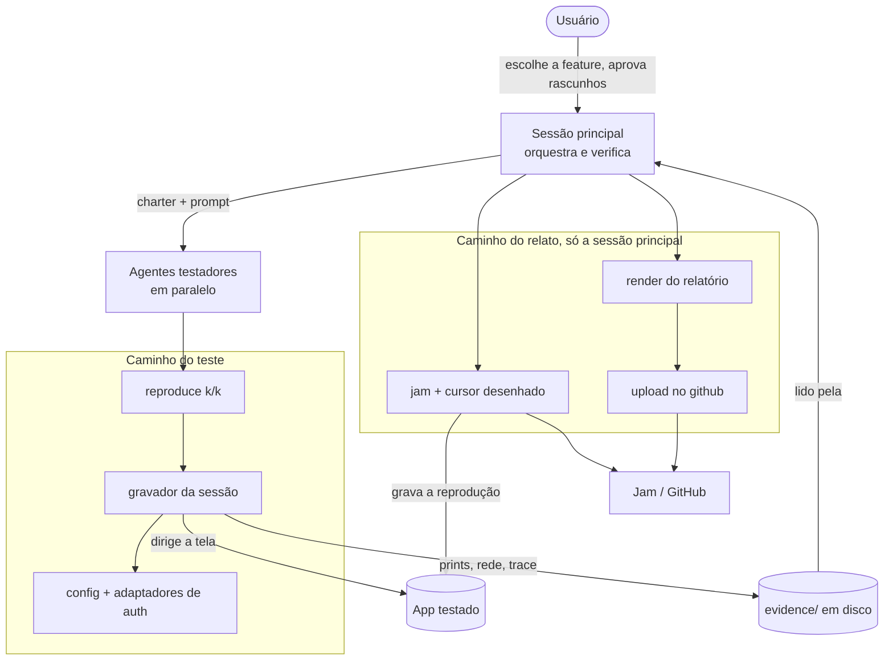
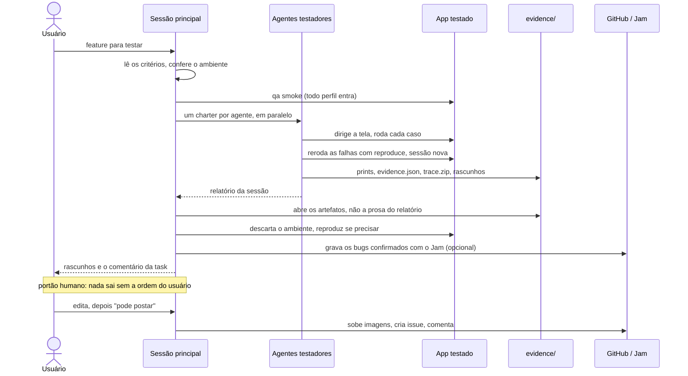
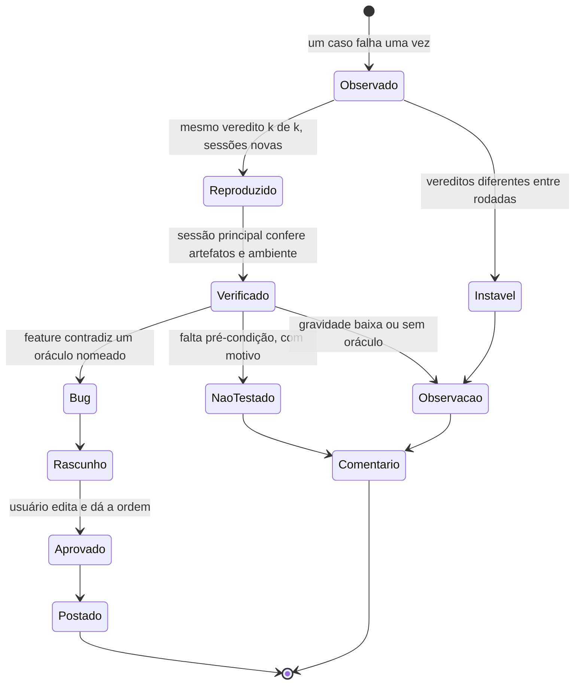
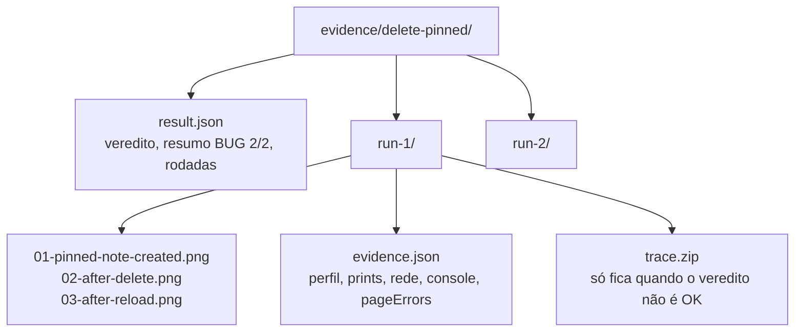

# Como o harness funciona

Esta página explica o desenho: quem faz o quê, para que serve cada peça da biblioteca e por que ela é assim. O passo a passo está no [tutorial](../tutorial/01-run-the-demo.md). As funções e os campos exatos estão na [referência da API](../reference/api.md) e no [formato da evidência](../reference/evidence.md).

## De onde veio

O harness nasceu como um punhado de scripts usados para fazer QA de uma aplicação web no ambiente de stage. As features se acumulavam esperando homologação e o time de QA não dava conta. Cada feature tinha que sair com um de dois resultados: comentário dizendo que foi testada e nada foi encontrado, ou issue de bug que um dev consegue reproduzir sem perguntar nada. Os scripts deixavam um agente LLM testar o backoffice pela tela, como um usuário faria, sem que um bug falso ou uma frase inventada chegasse ao issue tracker. Este repo é esse material sem nada que seja específico daquela plataforma: o login, o sistema de permissão e o domínio viraram configuração.

## As peças

Como ler: o caminho do teste, em cima, nunca chega ao Jam nem ao GitHub. O testador só toca a biblioteca pelo `reproduce` e pela sessão, e a sessão é a única coisa que fala com o app. Tudo o que o testador produz cai em `evidence/`, e a sessão principal lê dali. O caminho do relato, embaixo, é só da sessão principal, e as setas dele para fora só são usadas depois que o usuário aprovou um rascunho.

| Peça | Arquivo | O que faz |
|---|---|---|
| config + adaptadores de auth | `src/config.mjs`, `src/auth/index.mjs` | onde está o app, quais perfis existem e como cada um entra |
| gravador da sessão | `src/session.mjs` | uma página logada que grava a própria rede, console, prints e trace |
| reproduce | `src/reproduce.mjs` | roda um caso k vezes, cada uma num browser novo, e conta os vereditos iguais |
| cursor desenhado | `src/cursor.mjs` | ponteiro visível e clique em velocidade de gente, para gravação |
| jam | `src/jam.mjs` | dirige a extensão do Jam dentro do Chromium do Playwright |
| upload no github | `src/github.mjs` | sobe imagem por um browser logado e confere que ela carrega |
| render do relatório | `src/report.mjs` | transforma rascunho em título e corpo de issue, e recusa imagem quebrada |

## Uma rodada de QA

Como ler: a linha que importa é a nota. Antes dela, tudo é local e pode ir para o lixo. Depois dela, texto sai com o nome de alguém. O passo de verificação lê `evidence/`, não o relatório da sessão, e por isso a sessão principal tem duas setas para a direita: uma para os artefatos e outra de volta para o app.

## O que acontece com um achado

Como ler: só um caminho chega a `Postado` como issue, e ele atravessa três filtros: reprodução, verificação e aprovação. As outras saídas não são falha do processo. `NaoTestado` e `Observacao` também saem, dentro do comentário da task, para o time saber o que ficou sem cobertura e por quê.

## O que uma sessão grava

Como ler: uma pasta por caso, uma subpasta por rodada. Os prints são numerados na ordem em que foram tirados, então a pasta se lê como o passo a passo. O `evidence.json` guarda o que a página fez na rede (corpo só de erro e de escrita) e o que ela escreveu no console. O trace do Playwright, com snapshot do DOM e corpo das respostas, só fica nas rodadas que não passaram, porque é pesado e rodada que passou raramente precisa dele. A lista de campos está na [referência da evidência](../reference/evidence.md).

## Por que é assim

### O testador é caixa-preta de propósito

O agente testador dirige a tela e mais nada: sem código-fonte, sem chamar API na mão, sem banco, sem log. Se o testador lê o código, ele testa o que o código diz em vez do que a tela faz, e o relatório passa a confirmar a implementação em vez do requisito. A leitura de código continua existindo, mais tarde, na sessão principal, para achar a causa provável de um bug já reproduzido. Essa causa pode até mudar o dono do bug: no projeto de origem, um 500 atribuído à PR da feature vinha de um mapeamento de entidade antigo, não da PR.

### Muitos agentes pequenos ganham de poucos grandes

No projeto de origem, dois agentes com dez casos no total levaram 16 e 42 minutos, e a task demora o tempo do agente mais lento. A feature seguinte foi dividida entre quatro agentes de dois ou três casos cada (visualização, edição, validações, publicar e excluir), e cada um terminou entre 7 e 9 minutos. O prompt dá prazo de 15 minutos e pede relatório parcial se passar. A única restrição para paralelizar é de dado: dois agentes nunca editam o mesmo registro, senão um vê a edição do outro e reporta bug que não existe. É também por isso que todo registro criado por teste leva o `dataPrefix`.

### Auth é adaptador, com token gerado por sessão

A primeira versão copiava o cookie de sessão do próprio usuário, tirado do navegador. O token durava 20 minutos e o cookie 15, então um loop renovava a cada 10 minutos. Funcionava, mas todo teste rodava como uma pessoa só, com os papéis dela, e a rodada parava quando o token vencia antes do loop. Gerar um token por sessão para usuários de teste dedicados resolveu as duas coisas: cada critério de permissão ganhou um perfil próprio, e dois agentes puderam rodar ao mesmo tempo com papéis diferentes. Nem todo app deixa você assinar token, então o harness trata a entrada como adaptador, com a mesma interface para todos: cookie, header, storage state salvo de um login manual (para SSO e MFA), ou token HS256 gerado com uma chave que você pode ter num ambiente de teste. Ver [configurar auth](../how-to/configure-auth.md).

### A evidência de rede vem da própria página

A sessão grava as requisições que a página faz: método, rota, status e o corpo das respostas de erro e de escrita. É assim que um relatório de bug consegue dizer "a confirmação chama `DELETE /api/notes/{id}`, que devolve 500 sem corpo" sem o testador ter chamado a API. É evidência do que a tela fez, não de uma requisição que alguém montou na mão. Credencial sai antes de qualquer coisa ir para o disco: por padrão, texto com cara de JWT, bearer token e parâmetro do tipo `token=` viram `[REDACTED]`.

### O Jam pela própria extensão

O Jam grava vídeo, rede e console num link que o dev abre, e não tem API pública para criar gravação; o MCP dele só lê Jam que já existe. O que funciona é a própria extensão, carregada no Chromium do Playwright. Algumas escolhas parecem estranhas, e cada uma tem motivo:

- Chromium completo com `channel: 'chromium'`, porque o Chrome de marca ignora `--load-extension` e o headless shell padrão não roda extensão.
- Headless por padrão, porque um gerenciador de janelas em tiling redimensiona a janela visível, a captura da aba grava o tamanho real dela, e o vídeo sai espremido com faixa preta.
- `host_permissions` acrescentado no manifest da cópia descompactada, porque sem clique real no ícone a extensão nunca injeta na aba e o popup fica parado em "Starting Jam".
- Cursor desenhado e clique em velocidade de gente, porque o Chromium headless não tem ponteiro, e vídeo em que as coisas mudam sem clique visível não mostra ao dev o que aconteceu.

É a parte mais frágil do harness. Ela depende do texto do popup e do iframe de prévia da extensão, e uma versão nova do Jam pode quebrar. O [how-to do Jam](../how-to/record-with-jam.md) lista os sintomas e onde olhar.

### Imagem sobe por um browser

O `gh` cria issue mas não sobe anexo, e o lugar estável de uma imagem numa issue é uma URL `github.com/user-attachments`. O harness solta cada imagem na caixa de comentário de uma issue nova, num perfil de browser em que uma pessoa logou uma vez, lê a URL que o GitHub escreve no texto, limpa a caixa e não submete nada. Depois, o `qa issue render` se recusa a gerar o corpo enquanto alguma imagem apontar para caminho local, porque imagem quebrada numa issue postada é evidência que o leitor não vê.

### Uma pessoa decide o que é postado

O testador escreve rascunho. A sessão principal verifica e revisa. O usuário edita e dá a ordem. Issue errada gasta tempo do QA e do dev, e isso pesa mais que a velocidade de postar sozinho. No projeto de origem, uma feature rendeu dez rascunhos, cinco achados depois da verificação e duas issues; outra rendeu cinco achados, duas issues e três observações de gravidade baixa, que foram para o comentário da task. O raciocínio por trás dessa divisão está em [verificação](verification.md).

## Relacionados

- [Verificação](verification.md): por que um verificador separado, e como ele decide
- [Panorama](landscape.md): ferramentas parecidas e as referências por trás destas escolhas
- [Rodar com o Claude Code](../how-to/run-with-claude-code.md): a skill que conduz esse fluxo
